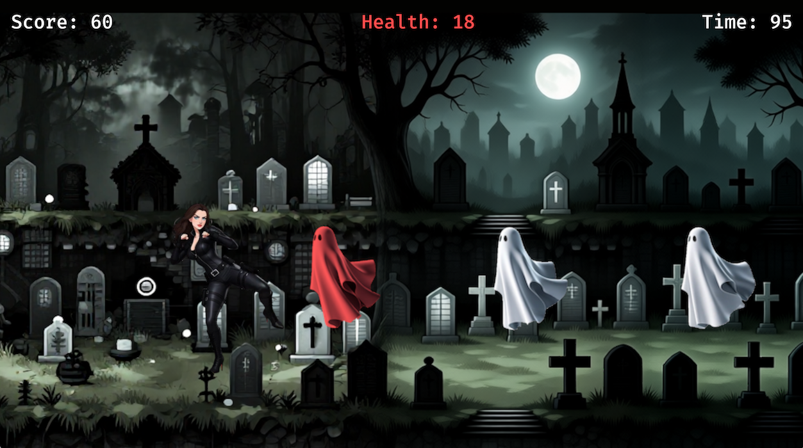

# Martial Magicka

A 2D side-scrolling martial arts brawler built as a hackathon demo to experiment with game development in Rust using the Bevy engine.



## What is this?

This project was created to explore Bevy's ECS (Entity Component System) architecture and learn game development patterns in Rust. Fight off waves of ghost enemies using punches, kicks, and combo attacks in a graveyard arena!

## Features

- **Fluid Combat System**: Punches, kicks, and multi-hit combos with a dedicated state machine
- **Dynamic AI Enemies**: Ghost enemies spawn from both sides and track the player's position
- **Smooth Animations**: Custom sprite sheet animations at 320x320 resolution
- **Modular Architecture**: Clean separation of player, enemy, combat, and common systems

## Quick Start

```bash
# Run the game (development mode with fast compile times)
cargo run

# Run optimized release build
cargo run --release
```

## Controls

- **A / D**: Run left/right
- **Shift + A/D**: Walk (slower movement)
- **Space**: Jump
- **Up Arrow**: Punch (tap twice quickly for combo, or in air for powerful aerial punch attack)
- **Down Arrow**: Kick (tap twice for combo, or after punch for mixed combo, or in air for powerful aerial kick attack)

## Tech Stack

- **Rust** - Systems programming language
- **Bevy 0.17.3** - Data-driven game engine with ECS architecture
- **ComfyUI** - Generative AI workflow tool, for asset creation using both Text-to-Image and Image-to-Video models
- **Suno** - AI-generated music (Pixel Showdown by jeffreymm)
- **Aseprite** - Pixel art tool for animations


## Project Structure

The codebase is organized into focused modules:
- `player/` - Combat state machine with 15 distinct states
- `enemy/` - AI behavior and spawning logic
- `combat/` - Hitbox collision and damage systems
- `common/` - Shared components (direction, animation)

## FAQ
### No SFX?
Sound effects were not implemented in this demo. The state machine can easily integrate it, so I may implement it in a future update.

### Where's the "magicka"?
"Martial Magicka" was just a whimsical bit of alliteration. When I started building this game I imagined there would eventually be combat specials like the hadoken from Street Fighter, however due to time constraints I focused on nailing the core martial arts combat mechanics first. Future iterations may introduce magical attacks and power-ups.

## License

MIT
